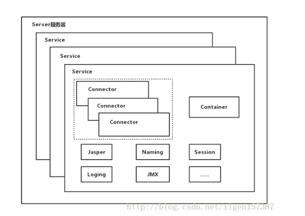
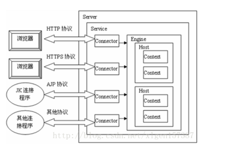
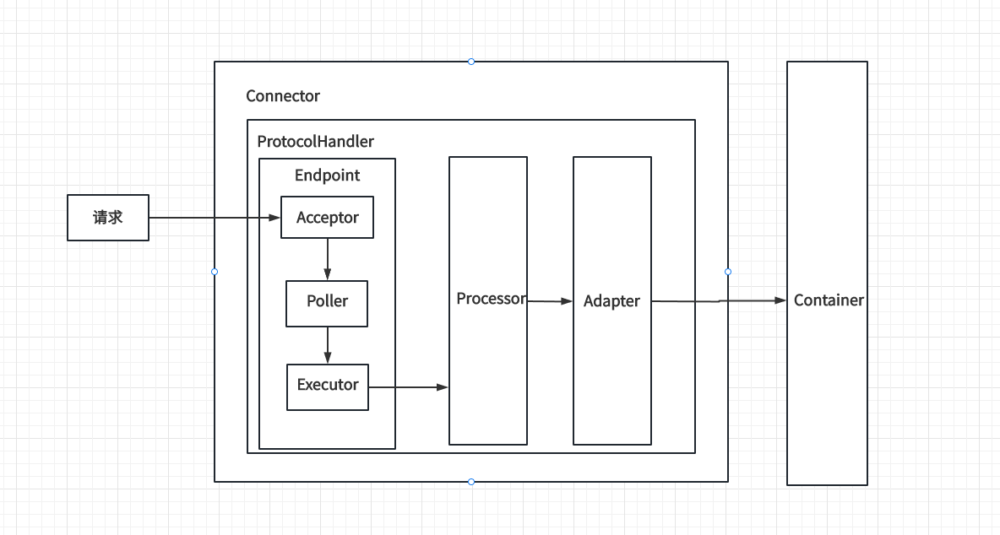
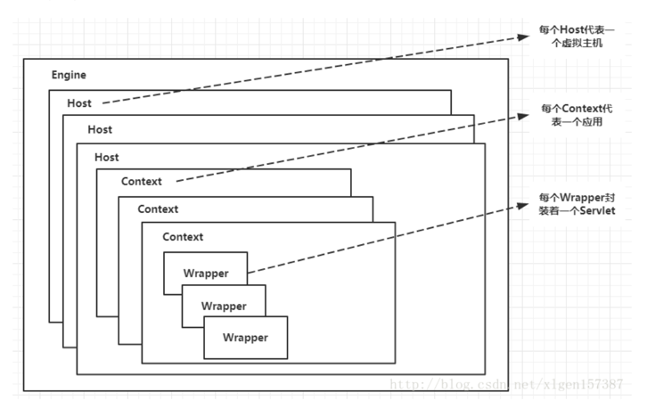
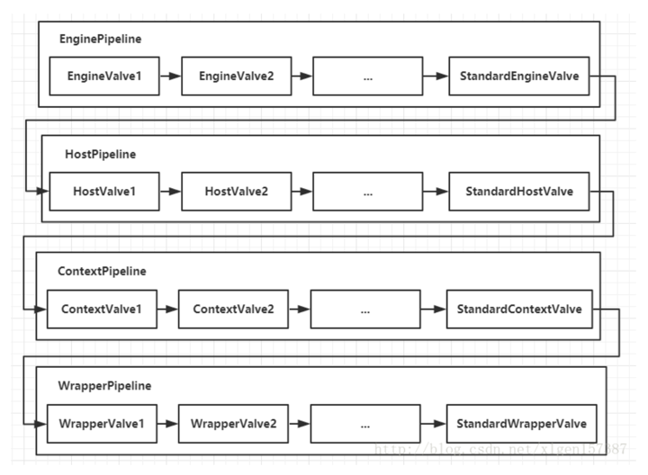

> 记录 Tomcat 实现原理中的关键逻辑

# Tomcat 架构

## Tomcat顶层架构

一个Tomcat中只有一个Server，一个Server可以包含多个Service，一个Service只有一个 Container（Engine），但是可以有多个Connectors。
PS：Engine、Host、Context 都属于 Container，但它们三个是父子关系。

代码层面体现：
- org/apache/catalina/startup/Catalina.java:106 ：一个Catalina只有一个Server。
- org/apache/catalina/core/StandardServer.java:134：一个Server对应多个Service。
- org/apache/catalina/core/StandardService.java:86：一个Service对应一个Engine。
- org/apache/catalina/core/StandardService.java:78：一个Service对应多个Connector。

多个Connector和一个Container形成一个Service。

总结下一个Service中各个组件的关联关系以及是如何串联起来的，以下流程都是在启动过程中完成的。
1. 根据 server.xml 完成 service、Engine、connector、 Host的关联关系，其中Engine与connector是平级的，而一个Engine下可能有多个Host。
2. 接着就是初始化Host的工作了，初始化Host很关键的一步就是处理 child（Context），Host 会根据 server.xml 配置文件中Host的appBase属性，扫描appBase目录，然后为appBase下的每一个一级目录创建一个对应的Context。
3. 上面处理每一个Context的过程中，也依然是需要处理每个Context的child（Wrapper），根据每个Context对应的web.xml（每个appBase下的一级目录中对应的web.xml）初始化对应的servlet（wrapper）。

## Connector 架构图

代码层面体现：
- org/apache/catalina/connector/Connector.java:243：一个Connector对应一个 ProtocolHandler
- org/apache/coyote/AbstractProtocol.java:74：一个 ProtocolHandler 对应一个 Endpoint
- org/apache/tomcat/util/net/NioEndpoint.java:257：Endpoint中包含一个Executor
- org/apache/tomcat/util/net/NioEndpoint.java:264：Endpoint中包含一个Poller
- org/apache/tomcat/util/net/NioEndpoint.java:270：Endpoint中包含一个Acceptor
- org/apache/tomcat/util/net/AbstractEndpoint.java:1245：新建一个Processor，然后扔到Executor中执行
- org/apache/coyote/AbstractProcessor.java:53：一个Processor对应一个Adapter
- org/apache/catalina/connector/CoyoteAdapter.java:343：在Adapter中调用container处理后续逻辑

## Container 架构

> Container用于封装和管理Servlet，以及具体处理Request请求，在Connector内部包含了4个子容器。
4个子容器的作用分别是：
1. `Engine`：引擎，用来管理多个站点，一个Service最多只能有一个Engine；
2. `Host`：代表一个站点，也可以叫虚拟主机，通过配置Host就可以添加站点；
3. `Context`：代表一个应用程序，对应着平时开发的一套程序，或者一个WEB-INF目录以及下面的web.xml文件；
4. `Wrapper`：每一Wrapper封装着一个Servlet；

Engine、Host、Context、Wrapper 都属于 Container，通过ContainerBase的children字段实现父子关系。

## Container 如何处理请求
Container处理请求是使用 `Pipeline-Valve` 管道来处理的！（Valve是阀门之意）

Pipeline-Valve使用的责任链模式和普通的责任链模式有些不同！区别主要有以下两点：
1. 每个Pipeline都有特定的Valve，而且是在管道的最后一个执行，这个Valve叫做BaseValve，BaseValve是不可删除的；
2. 在上层容器的管道的BaseValve中会调用下层容器的管道。

我们知道Container包含四个子容器，而这四个子容器对应的 `BaseValve` 分别在：StandardEngineValve、StandardHostValve、StandardContextValve、StandardWrapperValve。

Pipeline的处理流程图如下：

1. Connector在接收到请求后会首先调用最顶层容器的Pipeline来处理，这里的最顶层容器的Pipeline就是EnginePipeline（Engine的管道）；
2. 在Engine的管道中依次会执行EngineValve1、EngineValve2等等，最后会执行StandardEngineValve，在StandardEngineValve中会调用Host管道，然后再依次执行Host的HostValve1、HostValve2等，最后在执行StandardHostValve，然后再依次调用Context的管道和Wrapper的管道，最后执行到StandardWrapperValve。
3. 当执行到 `StandardWrapperValve` 的时候，会在StandardWrapperValve中创建FilterChain，并调用其doFilter方法来处理请求，这个FilterChain包含着我们配置的与请求相匹配的Filter和Servlet，其doFilter方法会依次调用所有的Filter的doFilter方法和Servlet的service方法，这样请求就得到了处理！
4. 当所有的Pipeline-Valve都执行完之后，并且处理完了具体的请求，这个时候就可以将返回的结果交给Connector了，Connector在通过Socket的方式将结果返回给客户端。

### 关于 pipeline
pipleline是一个接口，里面只有三个字段：
- basic：pipeline中最后会调用的的Valve。
- container：该pipeline关联的容器。
- frist：pipeline中第一个关联的Valve。

Pipeline只有一个实现类StandardPipeline。

### 关于 Valve
> Valve的invoke方法最后会调用next.invoke()方法，next的兜底是basicValve（org/apache/catalina/core/StandardPipeline.java:344）。

> 执行EnginePipeline -> HostPipeline -> ContextPipeline -> WrapperPipeline
>
用EnginePipeline详细说明：获取到first valve，然后沿着valve的next链式执行，最终执行到 StandardEngineValve，在 StandardEngineValve 的invoke方法中会指定一下个容器Host的pipeLine。

参考文章：
- [Tomcat系统架构](https://blog.csdn.net/xlgen157387/article/details/79006434)

# connector 核心参数
- `acceptCount`
    - `使用位置`：org/apache/tomcat/util/net/NioEndpoint.java:226
    - `作用`：实质上就是 ServerSocket 的 backLog 参数。
- `minSpareThreads`
    - `使用位置`：org/apache/tomcat/util/net/AbstractEndpoint.java:1054
    - `作用`：线程池（实际处理网络数据逻辑的线程池）的 corePoolSize 参数。
- `maxThreads`
    - `使用位置`：org/apache/tomcat/util/net/AbstractEndpoint.java:1054
    - `作用`：线程池（实际处理网络数据逻辑的线程池）的 maximumPoolSize 参数。
- `maxConnections`
  - `使用位置`：org/apache/tomcat/util/net/Acceptor.java:117
  - `作用`：Acceptor能同时接受的最大连接数。当前socket连接超过maxConnections的时候，Acceptor线程自己会阻塞等待，等连接降下去之后，才去处理Accept队列的下一个连接

参考文章：
- [Tomcat调优及acceptCount、maxConnections与maxThreads参数的含义和关系](https://blog.csdn.net/z69183787/article/details/128817991)

# 如何确定某个请求由哪个 Servlet 负责响应？
> 我们使用逆推的方式，看源码大部分情况下都是逆推。 根据我们的基础知识，我们知道最终决定由哪一个 Wrapper 处理我们的请求是在 Request 的 MappingData 对象的 wrapper 字段中的。 所以我们就得看沿着MappingData的wrapper属性逆向网上找，从而确定整个链路。

1. mappingData.wrapper = wrapper.object;：org/apache/catalina/mapper/Mapper.java:1004
2. wrapper从哪来：MappedWrapper wrapper = exactFind(wrappers, path);【org.apache.catalina.mapper.Mapper.MappedWrapper】
    1. 这里是根据path和MappedWrapper对象中的name属性进行匹配的。
3. wrappers从哪来：MappedWrapper[] exactWrappers = contextVersion.exactWrappers;【org/apache/catalina/mapper/Mapper.java:837】
4. contextVersion.exactWrappers从哪来：context.exactWrappers = newWrappers;【org/apache/catalina/mapper/Mapper.java:484】
5. newWrappers是一个数组，里面的元素是怎么构造的：MappedWrapper newWrapper = new MappedWrapper(name, wrapper, jspWildCard, resourceOnly);【org/apache/catalina/mapper/Mapper.java:480】
    1. 在第2步中MappedWrapper对象中的name属性就是在这一步设置进去的。
6. name和wrapper怎么来：
    - wrapper：addWrapper(contextVersion, wrapper.getMapping(), wrapper.getWrapper(), wrapper.isJspWildCard(),wrapper.isResourceOnly());的wrapper.getWrapper()【org/apache/catalina/mapper/Mapper.java:425】
    - name：addWrapper(contextVersion, wrapper.getMapping(), wrapper.getWrapper(), wrapper.isJspWildCard(),wrapper.isResourceOnly());的wrapper.getMapping()【org/apache/catalina/mapper/Mapper.java:425】
7. wrappers 从哪来：
    1. addWrappers(newContextVersion, wrappers);【org/apache/catalina/mapper/Mapper.java:277】
    2. prepareWrapperMappingInfo(context, (Wrapper) container, wrappers);【org/apache/catalina/mapper/MapperListener.java:377】
    3. prepareWrapperMappingInfo做了什么：wrappers.add(new WrapperMappingInfo(mapping, wrapper, jspWildCard, resourceOnly));
        - wrapper从哪来：wrapper其实就是context的小孩
        - mapping从哪来：String[] mappings = wrapper.findMappings();【org/apache/catalina/mapper/MapperListener.java:449】
            1. wrapper的mappings的元素在哪里保存：mappings.add(mapping);【org/apache/catalina/core/StandardWrapper.java:654】
            2. mapping如何构造：addServletMappingDecoded(String pattern, String name, boolean jspWildCard) 的pattern【org/apache/catalina/core/StandardContext.java:3012】
            3. pattern怎么来：org/apache/catalina/core/StandardContext.java:3006 -> org/apache/catalina/startup/ContextConfig.java:1289 -> org/apache/catalina/core/StandardContext.java:3006 -> org/apache/catalina/startup/ContextConfig.java:1287 -> 【注意：org/apache/catalina/core/StandardContext.java:3030 这一行保存了urlPattern对应的servletName的关系】
            4. webxml.getServletMappings元素如何构建：【org/apache/tomcat/util/descriptor/web/WebXml.java:1804】，再往上就不找了，实质上解析 web.xml 中的 servlet-mapping，pattern就是url-pattern，servlet-name就是servlet-name，url-pattern与servlet-name是多对一。

# 负责接收HTTP请求信息的 Request 对象是复用的吗？
> 根据源码，我们可以很容易定位到 Request 是出自于 Processor，而 Processor 就是 org.apache.tomcat.util.net.SocketWrapperBase.currentProcessor。

所以我们重点分析 org.apache.tomcat.util.net.SocketWrapperBase.currentProcessor 设置情况。【org/apache/coyote/AbstractProtocol.java:854】
这里重点两个方向，SocketWrapperBase 是复用的吗？currentProcessor是复用的吗？

## SocketWrapperBase 是复用的吗？
SocketProcessorBase 是将 SocketWrapperBase 再包一层，核心字段都在 SocketWrapperBase 中存放。

在 sc = createSocketProcessor(socketWrapper, event);【org/apache/tomcat/util/net/AbstractEndpoint.java:1239】中可以看到，每次请求 SocketProcessorBase 都是新的对象，但是 SocketWrapperBase 是传进来的，
我们再看看 SocketWrapperBase 的创建情况。

我们一路往上 trace，看到 NioSocketWrapper socketWrapper = (NioSocketWrapper) sk.attachment(); 【org/apache/tomcat/util/net/NioEndpoint.java:756】
可以看到 SocketWrapperBase 从 SelectionKey 的 attachment 中取出，我们再来 trace attachment【attachment是SocketWrapperBase的子类】。

SelectionKey 的 attachment 在 sc.register(getSelector(), SelectionKey.OP_READ, socketWrapper);【org/apache/tomcat/util/net/NioEndpoint.java:627】设置，这个代码其实就是在接受到注册事件之后，
再注册一个 OP_READ 事件，下次循环处理的时候就按照 REDA 逻辑处理。

上面的 socketWrapper 又是怎么来的呢？socketWrapper 是从 PollerEvent 中取出来的，在接受到请求的时候会将 socketWrapper 包装在 PollerEvent 对象中
然后将 PollerEvent 塞到 events 中。 poller.register(socketWrapper);【org/apache/tomcat/util/net/NioEndpoint.java:419】

# Servlet 的 response 是如何返回给客户端的
我们得先知道两个基础知识
1. servlet中是如何进行响应的：`resp.getWriter().println("hello");`，resp是 ServletResponse 接口的实现类，具体的实现类是 ResponseFacade。
2. websocket编程中是如何进行响应的：通过Socket的getOutputStream，然后在 OutputStream 中write出去。
所以我们要确定的就是 ResponseFacade 是如何跟 Socket的ResponseFacade关联的。

- ResponseFacade 的 response （connector/Response）是怎么来的，filterChain.doFilter(request.getRequest(), response.getResponse());【org/apache/catalina/core/StandardWrapperValve.java:155】
    - response.getResponse()方法中，会返回一个 ResponseFacade，其中（connector/Response）就是 this对象，因此 ResponseFacade与（connector/Response）关系绑定。
- 接下来只需要专心trace （connector/Response）的getWriter()，而的getWriter中最关键的就是outputBuffer字段。
- 一直往上trace，发现 response.setCoyoteResponse(res);【org/apache/catalina/connector/CoyoteAdapter.java:312】
  - 这里将 coyoteResponse 设置到 （connector/Response）的outputBuffer 字段中（关键）【所以 connector/response 的 outputResponse 就是 coyote/response】
  - 那么开始 trace coyoteResponse
    - coyoteResponse 是存储在 AbstractProcessor 中的【org/apache/coyote/AbstractProcessor.java:66】，在 【org/apache/coyote/http11/Http11Processor.java:174】位置为初始化 coyoteResponse的 outputBuffer（Http11OutputBuffer）。
    - 在【org/apache/coyote/http11/Http11Processor.java:702】会绑定coyoteResponse的 outputBuffer的socketWrapper。

额，实际上`resp.getWriter().println("hello");`只是把数据写入到 coyoteResponse的 outputBuffer 中，想要实现响应还是的靠 org.apache.catalina.connector.OutputBuffer类将缓冲区的数据写入到Socket连接中发送给客户端。

org/apache/tomcat/util/net/NioEndpoint.java:1336

机缘巧合之下（不会真的有人信吧，其实我是基于 socketWrapper进行trace），我发现了最终是在 org/apache/tomcat/util/net/NioEndpoint.java:1336 拿到 socket 并向客户端写出响应的。

## Servlet注解如何实现的？
## websocket如何实现的？
## 为什么tomcat能够加载到 webapps 下的 class 文件

connector/Response 的 writer【CoyoteWriter】 或者 outputBuffer 是什么时候设值的

org/apache/coyote/AbstractProcessor.java:79

一直到这 org/apache/catalina/connector/CoyoteAdapter.java:305 都还是 connector/response